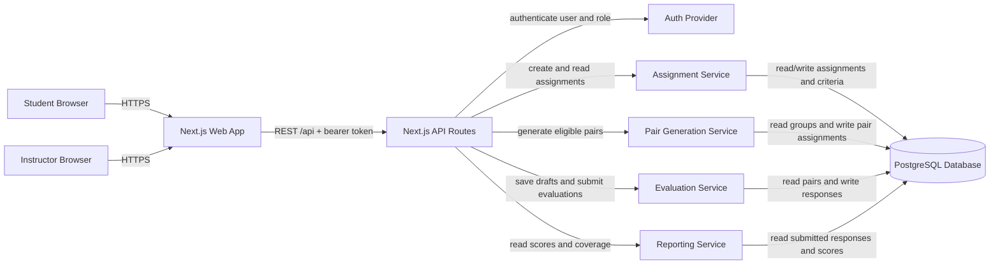

# PairEval Architecture

## Component Diagram

## Component Responsibilities

- **Next.js Web App:** Student และ Instructor ใช้หน้าจอระบบผ่าน browser
- **Next.js API Routes:** รับ REST request และตรวจ authorization
- **Auth Provider:** ยืนยันตัวตนและ role ของผู้ใช้
- **Assignment Service:** สร้าง Assignment, deadline และ criteria
- **Pair Generation Service:** สร้าง pairs และกัน self-evaluation
- **Evaluation Service:** Save draft และ Submit evaluation
- **Reporting Service:** แสดง score summary และ pair coverage
- **PostgreSQL Database:** เก็บข้อมูลระบบแบบถาวร