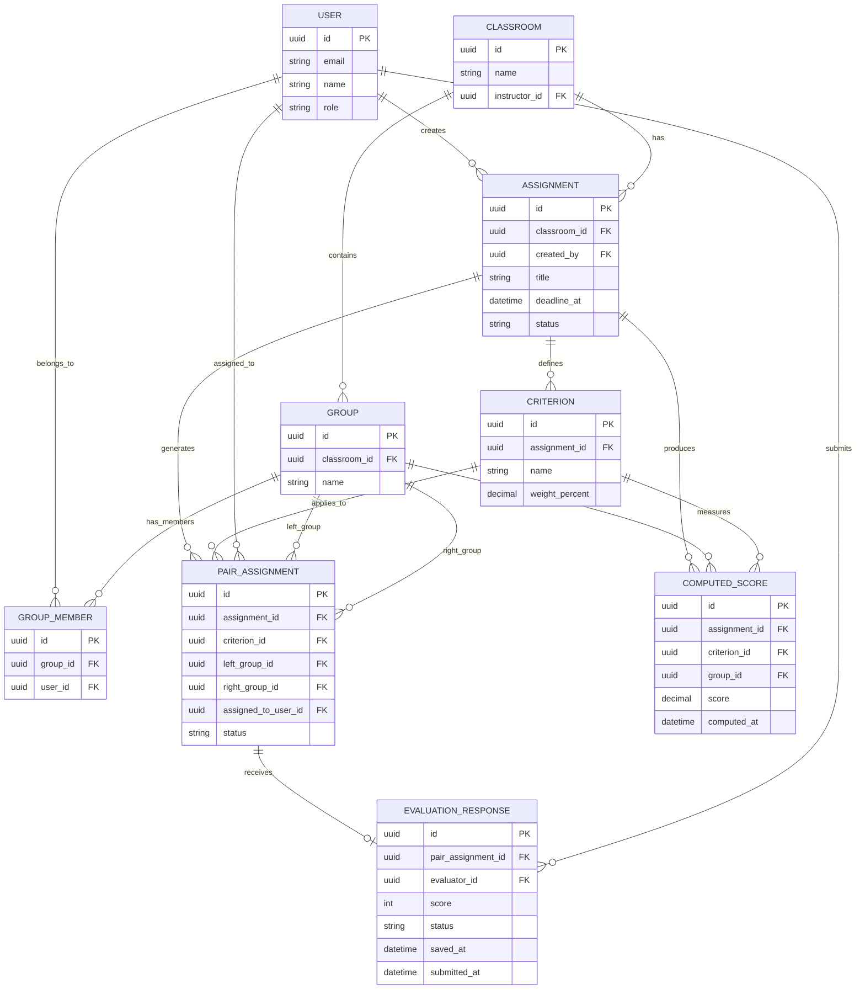

# PairEval Entity Relationship Diagram

# Comment
ความสัมพันธ์หลัก

- `ASSIGNMENT → CRITERION` = งานประเมินหนึ่งงานมีหลายเกณฑ์
- `ASSIGNMENT → PAIR_ASSIGNMENT` = งานหนึ่งงานสร้าง pairs หลายคู่
- `PAIR_ASSIGNMENT → EVALUATION_RESPONSE` = pair ที่แจกหนึ่งคู่มีคำตอบได้ศูนย์หรือหนึ่งชุดใน Lab MVP
- `GROUP_MEMBER` = ตารางกลางที่บอกว่านักศึกษาคนใดอยู่กลุ่มใด
- `COMPUTED_SCORE` = คะแนนที่ระบบคำนวณเพื่อใช้ในรายงานของอาจารย์