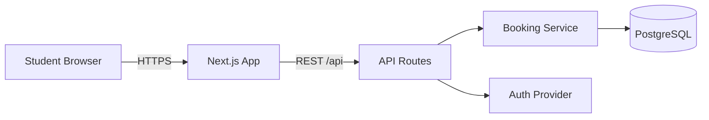
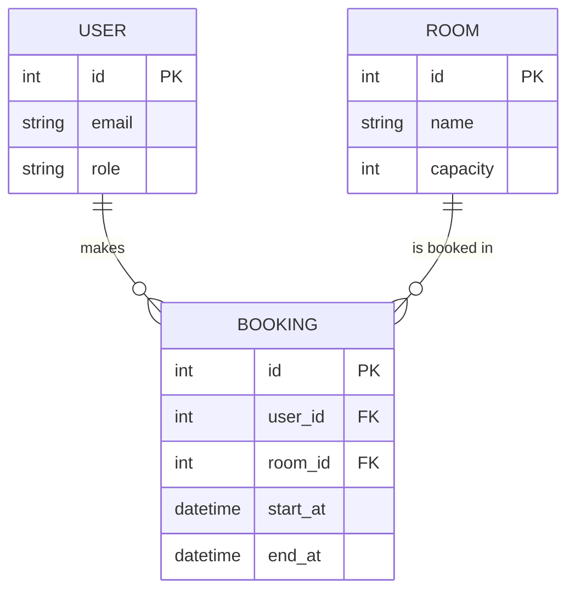

# Lab Instruction — Lab 02: Requirements & API Design

เอกสารขั้นตอนระหว่าง Lab; งานเตรียมก่อนเรียนอยู่ใน `01_prepared-before-lab-2.md`

> แหล่งอ้างอิงโจทย์: `SDPX-AI/WS-02-RUN-req-design/lab.md`
> เอกสารนี้มีตัวอย่าง PairEval และบันทึกระหว่างทำ Lab ประกอบด้วย ส่วนที่ระบุว่าเป็นบันทึกเก่าใช้เล่าลำดับการทำงาน ไม่ใช่สถานะปัจจุบัน

## เป้าหมาย

Intent → stories + AC → architecture → OpenAPI contract ที่ validate ผ่าน

เป้าหมายไม่ใช่เขียนโค้ดระบบจริง แต่คือออกแบบข้อกำหนดที่ตรวจสอบได้ และอธิบายได้ว่าทุก API มีที่มาจากความต้องการของผู้ใช้จริง

## 🎯 ทำ lab นี้แล้วได้ทักษะอะไร

| สิ่งที่จะทำได้ | ใช้ในงานจริงอย่างไร |
| --- | --- |
| แปลง requirement เป็น backlog ที่ตรวจสอบได้ | เป็นงานประจำของทุกคนในทีม ไม่ใช่แค่ Product Owner |
| เขียน OpenAPI spec ที่ validate ผ่านและ trace กลับหา story ได้ | ป้องกัน endpoint ที่ไม่มีใครต้องการ ซึ่งเป็น scope creep รูปแบบที่พบบ่อยที่สุด |
| คัดกรองข้อเสนอของ AI ว่าอันไหนรับ อันไหนไม่รับ พร้อมเหตุผล | ทักษะที่แยกคนใช้ AI เป็น ออกจากคนที่แค่ copy คำตอบ |
| บันทึกเจตนาและขอบเขตไว้ใน `intent.md` และ `unit-brief.md` | เมื่อทีมโตขึ้นหรือคนเปลี่ยน เอกสารเหล่านี้คือสิ่งเดียวที่บอกได้ว่าทำไมระบบถึงเป็นแบบนี้ |

---

## 📦 ของที่ต้องมีอยู่แล้วก่อนเริ่ม lab

lab นี้ **ไม่เริ่มจากศูนย์** — มันต่อยอดจากงานใน `WS-02--before` ทันที
ถ้าแถวไหนยังว่าง ให้จัดการแถวนั้นก่อนเป็นอย่างแรก แล้วค่อยไล่ขั้นตอนตามปกติ

| ต้องมี | จะถูกใช้ที่ | ถ้ายังไม่มี |
| --- | --- | --- |
| testing framework ที่รันได้ + คำสั่ง test ใน `AGENTS.md` | เป็นเงื่อนไขใน Definition of Done ที่เขียนใน lab ขั้นตอนที่ 1 และใช้เต็มรูปแบบใน WS-03 | เขียน DoD ที่บังคับใช้ไม่ได้จริง |
| component diagram ฉบับร่าง | lab ขั้นตอนที่ 2 — ขัดเกลาเป็น diagram ที่เข้า repo | ใช้เวลา 20 นาทีของ lab ไปกับการเริ่มวาดใหม่ |
| รายการคำถามที่ spec ยังตอบไม่ได้ | lab ขั้นตอนที่ 1 — ใช้ปิดช่องว่างของ requirement ก่อนเขียน AC | เขียน backlog บนสมมติฐานที่ยังไม่มีใครยืนยัน |

**แผนสำรองเมื่อของไม่ครบ:** จับคู่กับเพื่อนที่ทำมาแล้ว ใช้เครื่องของเขาเดินต่อ
แล้วตามเก็บงานของตัวเองหลังคาบ — สิ่งที่ห้ามทำคือให้ทั้งกลุ่มหยุดรอคนเดียว

---

## ขั้นตอนที่ 1 — Product Backlog

### สร้าง GitHub Issues เป็น Backlog

1. ไปที่ repo > Issues > Labels
2. สร้าง labels: `user-story`, `bug`, `enhancement`, `tech-debt`
3. ไปที่ Projects > New Project > Board

**บันทึกช่วงเริ่มทำ Lab (ก่อนมี repo กลาง):** ตอนนั้นโปรเจกต์ยังไม่มี Git remote ตามที่เราแยกไว้ จึงจะเขียนเป็น **local backlog draft** ก่อน แล้วค่อยย้ายแต่ละเรื่องไปเป็น GitHub Issue เมื่อสร้าง repo ของ Lab 02 ภายหลัง แบบนี้ไม่ข้ามเนื้อหาของ Lab

### เขียน User Stories ≥ 8 items

ไฟล์: `SPDX-Lab/AI-02/01_prepared-before-lab-2/product-backlog.md`

ใช้ template นี้สำหรับแต่ละ issue:

```markdown
## User Story
As a [role], I want to [action], so that [benefit].

## Acceptance Criteria
- Given [context], when [action], then [outcome].
- Given [context], when [action], then [outcome].

## Definition of Done
- [ ] Feature ทำงานได้ตาม acceptance criteria
- [ ] มี unit test ครอบคลุม business rule ของ story นี้
- [ ] มี E2E test สำหรับ AC อย่างน้อย 1 ข้อ (จะทำจริงใน WS-04)
- [ ] Code ผ่าน review จากสมาชิกในกลุ่ม
- [ ] Deploy ขึ้น staging แล้วเปิดใช้ได้จริง
```

**ทำอะไร:** เปลี่ยน requirement กว้าง ๆ ให้เป็นงานย่อยที่ตรวจ pass/fail ได้
**ทำไม:** Story นี้จะ trace ไปยัง API สร้าง assignment ใน OpenAPI ภายหลัง

สร้าง User Story ดังนี้

1. User Story 1 — สร้าง Assignment สำหรับประเมินกลุ่ม
2. User Story 2 — สร้างและแจก Pair Assignments
3. User Story 3 — นักศึกษาดู Pairs ที่ได้รับ
4. User Story 4 — บันทึก Draft
5. User Story 5 — Submit Evaluation
6. User Story 6 — นักศึกษาดูสถานะการส่ง
7. User Story 7 — อาจารย์ดูรายงานสรุป
8. User Story 8 — อาจารย์ดูสถานะความพร้อมของ Assignment

### ใช้ AI หา Edge Cases (ไม่ใช่ให้ AI เขียน story แทน)

เป้าหมายคือ AI เสนออย่างน้อย 5 edge cases แล้วคุณต้องไม่รับทุกข้ออัตโนมัติ
ให้เตรียมรายการต่อไปนี้

1. `product-backlog.md` ที่มี User Story ครบ 8 เรื่อง
2. เอกสารประกอบเพื่อให้ AI มี context:
    - `component-diagram-draft.md`
    - `open-questions.md`
    - `Pairwise Evaluation - Project Description.md`
3. เกณฑ์ตัดสินข้อเสนอ AI:
    - กระทบความยุติธรรมไหม เช่น ประเมินกลุ่มตัวเอง
    - กระทบคะแนนหรือ deadline ไหม
    - กระทบสิทธิ์/ข้อมูลส่วนตัวไหม
    - อยู่ในขอบเขต Lab นี้หรือไม่

Prompt ถาม US 01-08 :

```
Here are my user stories for [domain]:
[วาง stories]

What edge cases, error scenarios, or missing requirements
should I consider? List at least 5 specific cases.
For each, tell me what could go wrong in production if I ignore it.
```

Review ทุก suggestion แล้วแบ่งเป็น 3 กอง:

- **รับ** → สร้าง issue เพิ่ม
- **ไม่รับ** → เขียนเหตุผลสั้น ๆ ไว้ใน issue เดิม
- **ยังไม่ตัดสิน** → ใส่ label `tech-debt` ไว้ก่อน

ตารางบันทึกผลการพิจารณา

| Edge case from AI | ถ้าไม่จัดการจะเกิดอะไร | Decision | Reason |
| --- | --- | --- | --- |
| นักศึกษากด Submit ซ้ำ หรือ network retry request เดิม | คำตอบอาจถูกนับซ้ำ ทำให้คะแนนผิด | Accept | API ต้อง idempotent: หนึ่ง student มี submission ล่าสุดเพียงชุดเดียว |
| ระบบใช้เวลาเครื่องนักศึกษาแทนเวลา server ตรวจ deadline | นักศึกษาแก้เวลาเครื่องเพื่อส่งช้า หรือถูกปฏิเสธทั้งที่ส่งทัน | Accept | ตรวจ deadline จากเวลา server เท่านั้น |
| Classroom มีเพียง 2 กลุ่ม | ไม่มี evaluator จากกลุ่มที่สาม จึงห้ามประเมินกลุ่มตัวเองไม่ได้จริง | Accept | ปฏิเสธการ generate pairs และแจ้งเหตุผล |
| อาจารย์กด Generate Pairs สองครั้ง | เกิด pair ซ้ำ นักศึกษาได้งานเกิน และ coverage เพี้ยน | Accept | ระบบต้องกันการ generate ซ้ำ หรือให้ยืนยันการ replace ชุดเดิม |
| นักศึกษาแก้ pair ID ใน request เพื่อ save/submit แทนคนอื่น | ข้อมูลรั่วและมีการปลอมคำตอบ | Accept | Backend ตรวจว่า pair นั้นถูก assign ให้ผู้ใช้ที่ login อยู่จริง |
| อาจารย์ย้ายสมาชิกกลุ่มหลังสร้าง pairs แล้ว | pair และ draft เดิมไม่ตรงกับกลุ่มปัจจุบัน คะแนนอาจไม่ยุติธรรม | Deferred (`tech-debt`) | PRD เต็มมีเรื่อง re-generate/invalidate อยู่แล้ว แต่เรายังไม่รวมใน Lab MVP |
| อาจารย์แก้ criteria หรือน้ำหนักหลังเริ่มมี submission | คะแนนเดิมคำนวณคนละกติกากับคะแนนใหม่ | Deferred (`tech-debt`) | ต้องตัดสิน policy ก่อน เช่น lock criteria หลังเริ่มประเมิน |
| AI เสนอให้บังคับตอบครบทุก pair ก่อน Submit | ขัดกับ PRD ที่กำหนด partial credit สำหรับการส่งไม่ครบ | Reject | เราใช้การเตือน + ยืนยันการส่งไม่ครบแทน |
| AI เสนอให้แสดงชื่อ evaluator แก่นักศึกษาเพื่อความโปร่งใส | เสี่ยงต่อการตอบโต้กันและขัดกับ peer anonymity ใน PRD | Reject | Instructor ดูข้อมูลดิบได้ แต่ student ไม่เห็นผู้ประเมิน |

> ข้อสำคัญ: กอง "ไม่รับ" คือส่วนที่แสดงว่าคุณคิดเอง ไม่ใช่รับทุกอย่างที่ AI พูด
> ตอน present จะถูกถามเรื่องนี้

---

## ขั้นตอนที่ 2 — Architecture Diagrams

เราเคยทำ draft ใน `WS-02--before` แล้ว ตอนนี้นำมาทำเป็น artifact จริงของ Lab โดยให้รองรับ User Stories 1–8 ที่เขียนไว้

### Component Diagram

เขียนด้วย Mermaid ในไฟล์ `docs/architecture.md` — GitHub render ให้เอง
ข้อดีคือ diagram อยู่ใน git diff ได้ และ AI อ่านเป็น text ได้

````markdown

````

ต้องมีอย่างน้อย:

- Browser (Frontend)
- API Server (Backend)
- Database
- Auth
- ลูกศรพร้อม label ว่า protocol อะไร / เรียกอะไร

> ถ้าถนัดวาดด้วยมือ ใช้ [Excalidraw](https://excalidraw.com) แล้ว export PNG ไปที่
> `docs/architecture.png` ก็ได้ แต่ Mermaid จะมีประโยชน์กว่าเพราะ AI อ่านได้

**ทำอะไร:** เปลี่ยน diagram ร่างให้เป็น component diagram ที่ trace ไปยัง stories ได้
**ทำไม:** ทุก service ในภาพมีที่มาจาก User Story ที่เราเขียน เช่น Story 2 → Pair Generation Service และ Story 7 → Reporting Service

**สิ่งที่ทำ**

1. แยก Assignment, Pairing, Evaluation และ Reporting ออกจากกันตาม business responsibility เพื่อให้แต่ละส่วนมีขอบเขตชัดเจน โดย API Routes ทำหน้าที่รับ request และตรวจสิทธิ์ก่อนเรียก service ที่เหมาะสม

### ER Diagram

ERD อธิบายว่า “ข้อมูลอะไรต้องเก็บ” และ “ข้อมูลแต่ละชุดสัมพันธ์กันอย่างไร” เพื่อรองรับ User Stories 1–8
เขียนด้วย Mermaid `erDiagram` ในไฟล์ `docs/erd.md`
หรือใช้ [dbdiagram.io](https://dbdiagram.io) แล้ว export PNG ไปที่ `docs/erd.png`

````markdown

````

แต่ละ entity ต้องมี: attributes สำคัญ, primary key, relationships พร้อม cardinality (1:1, 1:N, N:M)

**ทำอะไร:** แปลง User Stories ให้เป็น entities, fields และ relationships
**ทำไม:** OpenAPI ขั้นถัดไปต้องรู้ว่า request/response รับและคืนข้อมูลอะไร และต้องใช้ FK ใดเชื่อมกัน

สิ่งที่ทำ

1. ใช้ ERD เชื่อม requirements กับข้อมูลจริง เช่น Assignment มีหลาย criteria, criteria หนึ่งสร้าง pair assignments หลายรายการ, และ response อ้างอิง pair ที่ถูกแจกให้ผู้ประเมินโดยตรง
2. โครงสร้างนี้ช่วยบังคับกฎว่าใครมีสิทธิ์ตอบ pair ใด

---

## ขั้นตอนที่ 3 — OpenAPI Specification

### Map User Stories ไปยัง API ก่อน

ยังไม่ให้ AI เขียน OpenAPI ทันที เพราะเราต้องกำหนดก่อนว่า endpoint ไหนมีที่มาจาก Story ใด เพื่อกัน AI คิด API เกินโจทย์
สร้างไฟล์:

```
docs/api-traceability.md
```

**ทำอะไร:** สร้าง traceability ระหว่าง requirement กับ API
**ทำไม:** ทุก endpoint มีเหตุผลรองรับ และทุก story มี API รองรับครบ ซึ่งเป็นเกณฑ์ผ่านของ Lab
สิ่งที่ทำ

1. map User Story ทุกข้อกับ endpoint ก่อน
2. จึงตรวจได้ว่าไม่มี API ที่ไม่มี requirement รองรับ และไม่มี requirement ที่ตกหล่น

### สร้างไฟล์ `docs/openapi.yaml`

**Step 1:** ให้ AI ร่าง โดย**ป้อน spec ที่เขียนเองเป็น context** ไม่ใช่บรรยายลอย ๆ
**ตัวอย่างการตั้งค่าที่ใช้ในโครงการ:** GPT-5.6 Terra / Medium แล้วส่ง prompt นี้ให้ AI ใน workspace เดียวกัน:

```
Read these project files first:

- SPDX-Lab/AI-02/01_prepared-before-lab-2/product-backlog.md
- SPDX-Lab/AI-02/01_prepared-before-lab-2/open-questions.md
- SPDX-Lab/AI-02/koencontrol-lab-02/docs/architecture.md
- SPDX-Lab/AI-02/koencontrol-lab-02/docs/erd.md
- SPDX-Lab/AI-02/koencontrol-lab-02/docs/api-traceability.md
- SPDX-Lab/AI-02/koencontrol-lab-02/Pairwise Evaluation - Project Description.md

Generate a draft OpenAPI 3.1 specification at:

SPDX-Lab/AI-02/koencontrol-lab-02/docs/openapi.yaml

Cover exactly the eight endpoints in docs/api-traceability.md.
Do not invent endpoints that no user story requests.

Requirements:
- Add `x-user-story` to every operation, for example `x-user-story: US-01`.
- Use `POST` with `201` for resource creation.
- Use suitable error responses from 400, 401, 403, 404, 409, and 422.
- Use one consistent Error schema for all errors.
- Define request and response schemas with required fields.
- Add a bearer-token security scheme and apply it to all endpoints.
- Enforce the rules from the stories: criteria weights total 100%, no self-evaluation,
  deadline checked on the server, partial submission allowed with confirmation,
  and instructor/student authorization.
- Add examples for at least one successful request and one error response.
```

**ทำอะไร:** ให้ AI ร่าง contract จาก documents ที่เราเขียนเอง
**ทำไม:** AI ช่วยลดงาน syntax YAML แต่เราคุม scope ผ่าน traceability table และต้อง review ทุก endpoint เอง
สิ่งที่ทำ

1. ให้ AI อ่าน User Stories, architecture, ERD และ traceability table จากนั้นกำชับให้สร้างเฉพาะ endpoints ที่มี story รองรับ และใส่ `x-user-story` เพื่อ trace กลับได้

**บันทึกการใช้ AI:** Generate

**Step 2:** Validate — นี่คือขั้น Verify ของ Spec Loop
ตอนนี้ต้องตรวจว่าไฟล์ OpenAPI ไม่ใช่แค่ “ดูเหมือนถูก” แต่เป็น contract ที่เครื่องมืออ่านได้จริง

```bash
# วิธีที่เร็วที่สุด: รันบรรทัดเดียว ไม่ต้องติดตั้งอะไร
npx @redocly/cli lint docs/openapi.yaml
```

หรือวางลง [Swagger Editor](https://editor.swagger.io) — ต้องไม่มี error

```
Need to install the following packages:
@redocly/cli@2.51.2
Ok to proceed? (y) y
No configurations were provided -- using built in recommended configuration by default.

validating docs\openapi.yaml...
[1] docs\openapi.yaml:2:1 at #/info

Info object should contain `license` field.

1 | openapi: 3.1.0
2 | info:
3 |   title: PairEval API
4 |   version: 1.0.0

Warning was generated by the info-license rule.

Reference: https://redocly.com/docs/cli/rules/oas/info-license

docs\openapi.yaml: validated in 51ms

Woohoo! Your API description is valid. 🎉
You have 1 warning.
```

แปลว่า OpenAPI 3.1 ของคุณ **ไม่มี error** และผ่านเกณฑ์หลักของ Lab แล้ว
ส่วนที่เหลือคือ warning เดียว: ยังไม่มีข้อมูล license ใน `info` ไม่ได้ทำให้ API ใช้ไม่ได้ แต่เราเก็บให้เรียบร้อยเพื่อให้ lint สะอาด

**ทำอะไร:** lint OpenAPI ด้วย Redocly
**ทำไม:** เป็นขั้น Verify ของ Spec Loop; ตรวจ syntax, schema และกฎพื้นฐานของ OpenAPI ก่อนนำไปใช้จริง
สิ่งที่ทำ

1. หลังให้ AI ร่าง OpenAPI ใช้ Redocly lint ตรวจ contract แบบอัตโนมัติ เพราะไฟล์ YAML ที่เปิดได้ไม่ได้แปลว่าเป็น OpenAPI specification ที่ถูกต้องเสมอ

#### ตัวอย่างการแก้ Warning เรื่อง License

เปิด `docs/openapi.yaml` แล้วเพิ่มใต้ `version` ใน section `info`:

```
info:
  title: PairEval API
  version: 1.0.0
  license:
    name: UNLICENSED
    identifier: LicenseRef-UNLICENSED
```

`UNLICENSED` ระบุว่าโครงงานยังไม่ได้ประกาศ license สาธารณะ และ `LicenseRef-UNLICENSED` เป็น identifier ที่ทำให้ผ่านกฎ strict ของ Redocly โดยไม่แอบอ้างว่าเป็น MIT หรือ Apache License
บันทึกแล้วรันซ้ำ:

```
npx @redocly/cli lint docs/openapi.yaml
```

ผลที่ต้องการคือ valid และไม่มี warning
**ทำอะไร:** เพิ่ม metadata ของ API ให้ครบตามมาตรฐาน lint
**ทำไม:** ผู้ใช้ API จะเห็นสถานะ license ชัดเจน และ OpenAPI contract ผ่านการตรวจแบบ strict
**สิ่งที่ทำ**

1. OpenAPI ผ่าน validation แล้ว
2. พบ warning เรื่อง license จึงระบุว่าโครงงานยังไม่มี public license
3. เพิ่ม identifier ที่ Redocly ตรวจสอบได้ ทำให้ specification ผ่านโดยไม่มี warning

**Step 3:** Review ทุก endpoint ด้วย checklist:
ไฟล์: `SPDX-Lab/AI-02/koencontrol-lab-02/docs/openapi-review.md`

- [ ] ทุก endpoint สืบกลับไปหา user story ได้ (ไม่มี endpoint ที่ AI คิดขึ้นเอง)
- [ ] ทุก user story มี endpoint รองรับครบ
- [ ] HTTP method ถูกต้อง — POST ตอบ 201 พร้อม body ของ resource ที่สร้าง
- [ ] Error responses มีครบ ไม่ใช่แค่ success case
- [ ] Request body schema มี `required` ครบทุก field ที่ขาดไม่ได้
- [ ] Authentication requirement ระบุแล้ว
- [ ] Error response ใช้รูปแบบเดียวกันทั้งไฟล์

**Step 4: เลือก 1 endpoint เพื่ออธิบายเอง**

แต่ละคนในกลุ่มเลือก 1 endpoint และอธิบายให้เพื่อนฟังก่อนจบ lab
รวมถึงตอบให้ได้ว่า "ถ้า client ส่ง request ที่ผิดแบบไหน จะได้ status อะไร"

แม้ AI อีกตัว review ให้แล้ว คุณต้องอ่าน endpoint ที่เลือกด้วยตัวเอง เพราะอาจารย์จะถามว่า request ผิดแบบไหนได้ status อะไร
ผมแนะนำเลือก:

```
POST /assignments
```

เพราะอธิบายง่ายและมีครบทั้ง create, authorization และ validation

เตรียมตอบ 5 เรื่องนี้จาก `openapi.yaml`:

- Request ส่งอะไรบ้าง: `title`, `deadlineAt`, `criteria`
- สำเร็จได้ `201` และได้ Assignment ที่สร้างกลับมา
- ไม่ login ได้ `401`
- student พยายามสร้าง Assignment ได้ `403`
- criteria weight รวมไม่ใช่ 100% หรือ deadline ไม่ถูกต้อง ได้ `422`

สิ่งที่เตรียมไว้พูดตอน Demo

1. Endpoint นี้ให้อาจารย์สร้าง Assignment โดยส่งชื่อ, deadline และ criteria
2. ระบบตรวจ bearer token และ role ก่อนสร้าง
3. ถ้าสำเร็จตอบ 201 พร้อมข้อมูล Assignment
4. แต่ถ้าเป็น student จะได้ 403
5. ถ้าน้ำหนัก criteria รวมไม่ครบ 100% จะได้ 422

ถ้า AI reviewer มีข้อแก้ไขใน `openapi.yaml` ให้รัน `npx @redocly/cli lint docs/openapi.yaml` ซ้ำอีกครั้งก่อน Demo

### ตัวอย่าง Demo — `POST /assignments`

จาก `openapi.yaml` จริง เลือก endpoint นี้ได้เหมาะที่สุด:

```
POST /api/assignments
```

#### 1. Request ที่ถูกต้อง

Client ต้องส่ง bearer token และ body นี้:

```
{
  "classroomId": "148fd37f-fba9-4e6c-b1bd-7d32e94aeaa1",
  "title": "Group evaluation 1",
  "deadlineAt": "2026-10-15T23:59:00+07:00",
  "criteria": [
    { "name": "User experience", "weightPercent": 60 },
    { "name": "Completeness", "weightPercent": 40 }
  ]
}
```

#### 2. กรณีสำเร็จ

ระบบสร้าง Assignment แล้วตอบ:

```
201 Created
```

พร้อมข้อมูล Assignment ที่สร้าง เช่น `id`, `title`, `deadlineAt`, `criteria`, `readiness`

#### 3. กรณี request ผิด

| กรณี | Status | เหตุผล |
| --- | --- | --- |
| ไม่ส่ง token / token หมดอายุ | `401` | ยังยืนยันตัวตนไม่ได้ |
| ส่ง token ของ student | `403` | student ไม่มีสิทธิ์สร้าง Assignment |
| weight เป็น 60% + 30% | `422` | criteria รวมไม่เท่ากับ 100% |
| deadline เป็นอดีต | `422` | deadline ต้องอยู่ในอนาคต |
| JSON ผิดรูปแบบ | `400` | request malformed |

#### บทพูด Demo

1. เลือก `POST /assignments` ซึ่ง trace กลับไปที่ US-01 สำหรับให้อาจารย์สร้างงานประเมินกลุ่ม
2. Client ต้องส่ง bearer token, classroom ID, ชื่อ Assignment, deadline และ criteria
3. ระบบตอบ 201 พร้อม Assignment ที่สร้างเมื่อสำเร็จ
4. หากไม่มี token ได้ 401,
5. หากเป็น student ได้ 403, และ
6. หากน้ำหนัก criteria รวมไม่เท่ากับ 100% หรือ deadline เป็นอดีต จะได้ 422 เพราะเป็น validation ของ business rule

คำถามที่อาจารย์อาจถาม: “ทำไมไม่ใช้ 400 เมื่อ weight ไม่ครบ 100%?”

> 400 ใช้เมื่อรูปแบบ request เสีย เช่น JSON ไม่ถูกต้อง แต่ 422 ใช้เมื่อรูปแบบข้อมูลอ่านได้แล้ว แต่ผิดกฎธุรกิจ เช่น weight รวมไม่เป็น 100%

---

## ขั้นตอนที่ 4 — Sprint Planning

ตั้ง GitHub Project board:

- **To Do** — stories ที่ยังไม่ได้ทำ
- **In Progress** — กำลังทำ
- **Done** — เสร็จแล้วตาม Definition of Done

เลือก stories สำหรับ Sprint 1 และ assign ให้สมาชิก
เลือกให้ **story แรกเล็กที่สุดเท่าที่จะทำได้** — เป้าหมายคือปิด loop ทั้งวง ไม่ใช่ทำ feature ใหญ่

---

## Artifacts ที่ต้องส่ง

| Artifact | รายละเอียด | ที่ส่ง |
| --- | --- | --- |
| GitHub Issues | User stories ≥ 8 items พร้อม acceptance criteria | GitHub repo |
| `docs/architecture.md` | Component diagram (Mermaid) | GitHub repo |
| `docs/erd.md` | ER diagram | GitHub repo |
| `docs/openapi.yaml` | OpenAPI spec ≥ 5 endpoints (validate ผ่าน) | GitHub repo |
| `memory-bank/intent.md` | ดูขั้นตอนเพิ่มเติมด้านล่าง | GitHub repo |
| `memory-bank/units/*/unit-brief.md` | อย่างน้อย 2 units | GitHub repo |

### เกณฑ์ผ่าน

- [ ] User stories ทุกอันมี acceptance criteria ที่ pass/fail ได้
- [ ] OpenAPI spec validate ผ่านโดยไม่มี error
- [ ] ทุก endpoint สืบกลับไปหา story ได้ และทุก story มี endpoint
- [ ] ทุกคนในกลุ่มอธิบาย endpoint ของตัวเองได้ รวมถึง error case

### บันทึกสถานะระหว่างทำ Lab (ก่อนสร้าง AI-DLC artifacts)

ข้อความและตารางต่อไปนี้เป็นบันทึก ณ ช่วงนั้น:

| Artifact | สถานะ | หมายเหตุ |
| --- | --- | --- |
| GitHub Issues ≥ 8 stories + AC | ร่างเสร็จ | มี `product-backlog.md` 8 stories แต่ยังไม่ได้สร้างเป็น GitHub Issues |
| `docs/architecture.md` | เสร็จ | มี Component Diagram Mermaid |
| `docs/erd.md` | เสร็จ | มี ER Diagram Mermaid |
| `docs/openapi.yaml` | เสร็จ | มี 8 endpoints และคุณ lint ผ่านแล้ว |
| `memory-bank/intent.md` | ยังไม่สร้าง | ต้องทำ |
| `memory-bank/units/*/unit-brief.md` ≥ 2 | ยังไม่สร้าง | ต้องทำ |

ดังนั้นในเชิงเนื้อหา เราทำเสร็จแล้ว **3 จาก 6 artifacts หลัก** และมี Backlog draft พร้อมแปลงเป็น GitHub Issues อีก 1 รายการ

ผลตรวจเกณฑ์ผ่าน ณ ช่วงที่บันทึก:

| เกณฑ์ | สถานะ |
| --- | --- |
| ทุก User Story มี AC แบบ pass/fail | พร้อมจาก Backlog draft |
| OpenAPI validate ไม่มี error | ผ่าน |
| ทุก endpoint trace กลับ Story และทุก Story มี endpoint | ผ่านจาก `api-traceability.md` และ `x-user-story` |
| ทุกคนอธิบาย endpoint และ error case ได้ | คุณเตรียม `POST /assignments` แล้ว; ต้องซ้อมอธิบายเอง |

---

## ขั้นตอนเพิ่มเติม: AI-DLC Inception Artifacts

AI-DLC Inception Artifacts คือเอกสารตั้งต้นของโครงการสำหรับทั้งคนในทีมและ AI เพื่อให้เข้าใจตรงกันว่า

- ระบบนี้สร้างมาเพื่ออะไร
- ทำอะไรและไม่ทำอะไร
- ตัดสินใจเรื่องสำคัญอะไรแล้ว
- แต่ละส่วนของระบบรับผิดชอบอะไร
ใน Lab 02 มี 2 อย่าง:

1. `memory-bank/intent.md`
    คือ “เจตนาของระบบ” ระดับภาพรวม เช่น PairEval แก้ปัญหาอะไร, ใครใช้, เป้าหมายคืออะไร, อะไรอยู่นอกขอบเขต

2. `memory-bank/units/*/unit-brief.md`
    คือ “บัตรประจำตัวของแต่ละส่วนระบบ” เช่น `pairing` และ `evaluation` โดยระบุว่าแต่ละ unit ทำอะไร, ไม่ทำอะไร, พึ่งพาใคร และมีกฎธุรกิจอะไร

ตัวอย่างความต่าง:

```
intent.md
→ PairEval มีเป้าหมายทำให้การประเมินแบบ pairwise ยุติธรรมและตรวจสอบได้

unit-brief ของ Pairing
→ สร้างและแจก pairs
→ ห้ามแจก pair ที่มีกลุ่มของ evaluator อยู่
→ ไม่รับผิดชอบบันทึกคะแนน
```

**ทำไมต้องมี:** เมื่อ AI หรือสมาชิกใหม่เข้ามาทำงาน จะไม่เดา scope ใหม่หรือให้ Pairing ไปทำงานของ Evaluation

### สร้าง `memory-bank/intent.md`

ไฟล์: `SPDX-Lab/AI-02/koencontrol-lab-02/memory-bank/intent.md`

```markdown
# Intent: Campus [Domain] Service

## Intent Statement
[1-2 ประโยคบอก high-level goal]
เช่น: "Enable university students to book study rooms online,
reducing manual processes and room conflicts."

## Business Context
- **Problem:** [ปัญหาที่แก้]
- **Users:** [กลุ่ม users หลัก]
- **Value:** [ประโยชน์ที่ได้]

## Success Criteria
- [ ] [วัดผลได้ข้อที่ 1]
- [ ] [วัดผลได้ข้อที่ 2]
- [ ] [วัดผลได้ข้อที่ 3]

## Decisions Already Made
- [สิ่งที่ตัดสินใจแล้ว เพื่อไม่ให้ AI เสนอทางเลือกซ้ำทุกครั้ง]

## Out of Scope
- [สิ่งที่ไม่ทำใน course นี้]

## Status
In Progress — WS-02
```

**ทำอะไร:** บันทึกเป้าหมาย ขอบเขต และการตัดสินใจของ Lab 02
**ทำไม:** ป้องกัน AI หรือสมาชิกทีมเสนอฟีเจอร์ที่อยู่นอก scope เช่น Individual Evaluation หรือ Export
**สิ่งที่ทำ**

1. ใช้ intent.md เป็น source of truth ของ Lab 02 โดยกำหนดว่าเราทำเฉพาะ Group Evaluation
2. บันทึกกฎสำคัญ เช่น server ตรวจ deadline, ห้าม self-evaluation และ submission ที่ส่งแล้วแก้ไม่ได้ใน MVP

> **Context Engineering Note:** section *Decisions Already Made* และ *Out of Scope*
> มีค่ามากกว่าที่คิด เพราะมันคือสิ่งที่หยุด AI จากการเสนอ scope ที่เราตัดทิ้งไปแล้วซ้ำ ๆ

### สร้าง Unit Briefs

จาก component diagram ที่วาด ระบุ units ที่ loosely coupled:

```bash
mkdir -p memory-bank/units/[unit-name]
```

สร้าง `memory-bank/units/[unit-name]/unit-brief.md` สำหรับแต่ละ unit:

```markdown
# Unit: [Unit Name]

## Purpose
[1 ประโยคบอกว่า unit นี้ทำอะไร]

## Responsibilities
- [สิ่งที่ unit นี้รับผิดชอบ]

## NOT Responsible For
- [สิ่งที่ unit อื่นรับผิดชอบ]

## Dependencies
- Depends on: [units ที่ต้องใช้]
- Used by: [units ที่ใช้ unit นี้]

## Key Business Rules
- [กฎที่ต้องเป็นจริงเสมอ — จะกลายเป็น unit test ใน WS-03]

## Key Stories
- [link ไป GitHub Issues]

## Bolt Type
[ ] DDD Construction — ถ้า domain logic ซับซ้อน
[x] Simple Construction — ถ้าเป็น UI, integration, utility
```

เราจะใช้ 2 units ที่แยก responsibility ชัดที่สุด

#### ตัวอย่าง Unit 1 — Pairing

สร้างไฟล์ `memory-bank/units/pairing/unit-brief.md`

#### ตัวอย่าง Unit 2 — Evaluation

สร้างไฟล์ `memory-bank/units/evaluation/unit-brief.md`
**Human Checkpoint:** ก่อน commit — ถามตัวเองว่า unit นี้ทำได้โดยไม่ต้องรู้ implementation
ของ unit อื่นไหม ถ้าตอบว่าใช่ = loosely coupled ที่ดี

**ทำอะไร:** แยก Pairing และ Evaluation เป็นหน่วยงานที่มีขอบเขตชัด
**ทำไม:** กฎใน `Key Business Rules` จะกลายเป็น unit tests ใน WS-03 ได้โดยตรง
**พูดตอน Demo:**

1. แยก Pairing ออกจาก Evaluation
2. เพราะ Pairing ดูแลความยุติธรรมของการแจกคู่
3. ส่วน Evaluation ดูแล draft, deadline และ submission จึงทดสอบ business rules แยกกันได้

> section *Key Business Rules* คือสะพานไปหา WS-03 —
> ทุกกฎที่เขียนไว้ตรงนี้ ควรมี unit test คู่กันหนึ่งตัวในอีก 2 สัปดาห์

## บันทึกสรุประหว่างทำ Lab (ก่อนสร้าง GitHub Issues)

ถ้าไม่นับ GitHub: **Lab 02 ส่วนเอกสารและการออกแบบเสร็จแล้วครับ**

เสร็จแล้ว:

- `WS-02--before`: Vitest รันผ่าน
- User Stories 8 เรื่อง พร้อม AC และ DoD
- Edge-case review: Accept / Reject / Deferred
- `docs/architecture.md`
- `docs/erd.md`
- `docs/openapi.yaml` มี 8 endpoints และ lint ผ่าน
- `docs/api-traceability.md` และ `docs/openapi-review.md`
- `memory-bank/intent.md`
- Unit Briefs: `pairing` และ `evaluation`
- เตรียม Demo `POST /assignments` พร้อม status error cases

สิ่งที่ยังไม่ครบ หากจะนับว่า “จบ Lab ตาม rubric”:

- GitHub Issues จาก 8 stories
- GitHub Project board: To Do / In Progress / Done
- เลือก Sprint 1 และ assign งานให้สมาชิก

และ checkbox ใน Definition of Done เรื่อง code review, E2E test, staging deploy ยังไม่ต้องติ๊ก เพราะเป็นงาน implementation ของ Lab/สัปดาห์ถัดไป ไม่ใช่งานออกแบบของ Lab 02 ครับ

## คู่มือประกอบ — สร้าง Issues และ Board ใน repo กลาง

ส่วนนี้ขยายขั้นตอน Product Backlog และ Sprint Planning สำหรับโครงการ PairEval โดยเก็บตัวอย่าง Issue พร้อม AC และ DoD เดิมครบทั้ง 8 เรื่อง

ทำ Lab 02 ใน repo กลางนี้เท่านั้น:

```
napgat/koencontrol-sdpx_lab
```

เหตุผลคือ working copy และ repo กลางแยกจาก `napgat/KMITL` monorepo แล้ว จึงสร้าง Issues และ Project board ได้โดยไม่กระทบโปรเจกต์หลัก

### ขั้นที่ 1: สร้าง Labels ใน `napgat/koencontrol-sdpx_lab`

เข้า repo → **Issues** → **Labels**

ให้ตรวจ/สร้าง labels เหล่านี้:

- `user-story`
- `bug`
- `enhancement`
- `tech-debt`

โดย Lab 02 จะใช้หลัก ๆ คือ:

```
user-story  → ทั้ง 8 stories
tech-debt   → เรื่องที่เลื่อนไปก่อน เช่น group reassignment / criteria changes
```

สิ่งที่พูดตอน Demo:

> “ผมแยก Lab 02 ไปทำใน repo กลาง `koencontrol-sdpx_lab` เพื่อไม่กระทบ KMITL monorepo จากนั้นใช้ labels จัดประเภท backlog ให้เห็นว่าอะไรคือ user story และอะไรคือ technical debt”

สร้าง labels เสร็จแล้ว เราจะเริ่มสร้าง Issue 1 ครับ

### ขั้นที่ 2: สร้าง Issue 1

เข้า **Issues** → **New issue**

ตั้งค่า:

```
Title: US-01: Instructor creates a group-evaluation assignment
Label: user-story
```

วางเนื้อหานี้:

```
## User Story

As an instructor, I want to create a group-evaluation assignment
with a title, deadline, and criteria, so that students can be assigned
a clearly defined evaluation task.

## Acceptance Criteria

- Given I am an authenticated instructor, when I provide a title, a future deadline, and criteria whose total weight is 100%, then the system creates the assignment successfully.
- Given the criteria weights do not total 100%, when I try to create the assignment, then the system rejects the request and explains that the total must equal 100%.
- Given I am a student, when I try to create an assignment, then the system denies access.

## Definition of Done

- [ ] Feature works according to the acceptance criteria.
- [ ] Unit tests cover the assignment-validation business rules.
- [ ] At least one acceptance criterion has an E2E test in WS-04.
- [ ] Code is reviewed by a group member.
- [ ] The feature is deployed to staging and can be used.
```

**ทำอะไร:** เปลี่ยน Story 1 จาก local backlog เป็นงานที่ติดตามได้ใน GitHub
**ทำไม:** Issue คือแหล่งอ้างอิงกลางของทีม และ OpenAPI/E2E จะ trace กลับมาได้ภายหลัง
**พูดตอน Demo:**

> “Issue US-01 กำหนดงานสร้าง Assignment พร้อม AC ที่ตรวจสอบได้ทั้ง success case, validation ของ criteria weight และ authorization ของ instructor”

กด **Create new issue** แล้วส่งเลข Issue มาให้ผมครับ
บันทึกไว้: **US-01 = Issue #1**

### ขั้นที่ 3: สร้าง Issue 2

```
Title: US-02: System generates fair group-evaluation pairs
Label: user-story
```

```
## User Story

As an instructor, I want the system to generate and assign group-evaluation
pairs for each criterion, so that students receive fair comparisons to evaluate.

## Acceptance Criteria

- Given an assignment has valid criteria and at least three groups, when I generate pair assignments, then the system creates comparison pairs for every criterion and assigns them to eligible students.
- Given a student belongs to one of the groups in a comparison pair, when the system assigns pairs, then that student does not receive that pair for evaluation.
- Given there are fewer than three groups, when I generate pair assignments, then the system rejects the request and explains that no eligible external evaluator is available.
- Given pair generation succeeds, when I view the assignment, then I can see that pair assignments have been generated.

## Definition of Done

- [ ] Feature works according to the acceptance criteria.
- [ ] Unit tests cover pair-generation and self-evaluation rules.
- [ ] At least one acceptance criterion has an E2E test in WS-04.
- [ ] Code is reviewed by a group member.
- [ ] The feature is deployed to staging and can be used.
```

**ทำอะไร:** บันทึกกฎการสร้าง pairs แยกจากการสร้าง Assignment
**ทำไม:** กฎห้ามประเมินกลุ่มตัวเองเป็น business rule สำคัญ ต้องติดตามและทดสอบแยกได้
**พูดตอน Demo:**

> “US-02 ทำให้การแจก pair ยุติธรรม โดยระบบต้องกันไม่ให้นักศึกษาประเมินกลุ่มของตัวเอง และต้องแจ้งได้หากมีจำนวนกลุ่มไม่พอ”

สร้างเสร็จแล้วส่งเลข Issue 2 มาได้เลยครับ

### ขั้นที่ 4: สร้าง Issue 3

```
Title: US-03: Student views assigned evaluation pairs
Label: user-story
```

```
## User Story

As a student, I want to view my assigned group-evaluation pairs,
criteria, and deadline, so that I know what I must evaluate and when
I must submit it.

## Acceptance Criteria

- Given I am an authenticated student with assigned pairs, when I open an active assignment, then I see only my assigned group pairs, grouped by criterion.
- Given I open an active assignment, when the deadline exists, then I see its date, time, and timezone clearly.
- Given I have no assigned pairs for an assignment, when I open it, then the system shows an informative empty state instead of showing other students' pairs.
- Given I am a student, when I try to access another student's assigned pairs, then the system denies access.

## Definition of Done

- [ ] Feature works according to the acceptance criteria.
- [ ] Unit tests cover the data-access and assignment-visibility rules.
- [ ] At least one acceptance criterion has an E2E test in WS-04.
- [ ] Code is reviewed by a group member.
- [ ] The feature is deployed to staging and can be used.
```

**ทำอะไร:** กำหนดว่านักศึกษาเห็นเฉพาะ pairs ของตนเอง พร้อม criteria และ deadline
**ทำไม:** ป้องกันข้อมูลรั่วและช่วยให้นักศึกษารู้ว่าต้องทำอะไร
**พูดตอน Demo:**

> “US-03 บังคับ data isolation นักศึกษาเห็นได้เฉพาะ pair ที่ระบบมอบหมายให้ตนเอง และเห็น deadline พร้อม timezone เพื่อลดการส่งงานผิดเวลา”

สร้างเสร็จแล้วพิมพ์ “ต่อ” ได้เลยครับ

### ขั้นที่ 5: สร้าง Issue 4 — Draft Save

```
Title: US-04: Student saves evaluation progress as a draft
Label: user-story
```

```
## User Story

As a student, I want to save my evaluation progress as a draft,
so that I can return later without losing answers I have already entered.

## Acceptance Criteria

- Given I have assigned pairs in an active assignment, when I select scores for one or more pairs and save, then the system stores my answers as a draft.
- Given I have an existing draft, when I change scores and save again, then the system updates the draft with my latest answers.
- Given I have not answered every assigned pair, when I save a draft, then the system allows the save and clearly indicates that the evaluation is not yet submitted.
- Given I open an assignment with an existing draft, when the page loads, then the system shows my previously saved answers.
- Given I try to save answers for pairs not assigned to me, when I send the request, then the system denies the request.

## Definition of Done

- [ ] Feature works according to the acceptance criteria.
- [ ] Unit tests cover draft-save and access-control rules.
- [ ] At least one acceptance criterion has an E2E test in WS-04.
- [ ] Code is reviewed by a group member.
- [ ] The feature is deployed to staging and can be used.
```

**ทำอะไร:** แยกการ Save draft ออกจากการ Submit
**ทำไม:** Draft ตอบไม่ครบได้และยังไม่มีผลต่อคะแนน ส่วน Submit คือการส่งจริง
**พูดตอน Demo:**

> “US-04 ทำให้นักศึกษาบันทึกความคืบหน้าได้โดยไม่เสียข้อมูล แต่ระบบยังระบุชัดว่า draft ไม่ใช่ submission และไม่อนุญาตให้บันทึกแทนผู้ใช้คนอื่น”

สร้างเสร็จแล้ว ส่งเลข Issue นี้ให้ผมด้วยครับ เพราะ E2E ของ Lab 04 ต้องเปลี่ยน trace ชั่วคราวให้ชี้มาที่ Issue จริงนี้.

### ขั้นที่ 6: สร้าง Issue 5 — Submit Evaluation

```
Title: US-05: Student submits an evaluation
Label: user-story
```

```
## User Story

As a student, I want to submit my group evaluation before the deadline,
so that my responses are included in the assignment results.

## Acceptance Criteria

- Given I have assigned pairs and the deadline has not passed, when I submit my evaluation, then the system records my latest answers with a submitted timestamp.
- Given I have answered only some assigned pairs, when I submit, then the system shows my completion progress and asks me to confirm that the submission is incomplete.
- Given I confirm an incomplete submission before the deadline, when the submission succeeds, then the system records it for partial-credit calculation.
- Given the deadline has passed, when I try to submit, then the system rejects the request and explains that the assignment is closed.
- Given I have submitted the evaluation in this Lab MVP, when I try to change answers, then the system does not allow editing.

## Definition of Done

- [ ] Feature works according to the acceptance criteria.
- [ ] Unit tests cover deadline and partial-submission rules.
- [ ] At least one acceptance criterion has an E2E test in WS-04.
- [ ] Code is reviewed by a group member.
- [ ] The feature is deployed to staging and can be used.
```

**ทำอะไร:** กำหนดจุดที่คำตอบเปลี่ยนจาก draft เป็น submission
**ทำไม:** ระบบต้องตรวจ deadline ที่ฝั่ง server และรองรับ partial credit ตาม requirement
**พูดตอน Demo:**

> “US-05 แยกการ Submit ออกจาก Save draft โดย server จะบันทึกเวลาส่ง ตรวจ deadline และให้ผู้เรียนยืนยันก่อนส่งงานที่ตอบไม่ครบ”

### ขั้นที่ 7: สร้าง Issue 6 — Submission Status

```
Title: US-06: Student views submission status
Label: user-story
```

```
## User Story

As a student, I want to see the status and timestamp of my evaluation
submission, so that I know whether the system has recorded my work.

## Acceptance Criteria

- Given I have submitted an evaluation, when I open the assignment, then I see a Submitted status and the timestamp of my submission.
- Given I have saved a draft but have not submitted, when I open the assignment, then I see a Draft status and a clear message that it does not yet count as a submission.
- Given I have not saved or submitted any answers, when I open the assignment, then I see a Not Started status.
- Given I am a student, when I view an assignment, then I see only my own submission status and not another student's status.

## Definition of Done

- [ ] Feature works according to the acceptance criteria.
- [ ] Unit tests cover status-display and data-isolation rules.
- [ ] At least one acceptance criterion has an E2E test in WS-04.
- [ ] Code is reviewed by a group member.
- [ ] The feature is deployed to staging and can be used.
```

**ทำอะไร:** กำหนดสถานะ `Not Started`, `Draft`, และ `Submitted` ให้ผู้เรียนเห็น
**ทำไม:** ป้องกันความเข้าใจผิดว่า Save draft แล้วเท่ากับส่งงานแล้ว
**พูดตอน Demo:**

> “US-06 ให้ผู้เรียนตรวจสอบได้ชัดเจนว่างานอยู่สถานะใด พร้อมเวลาส่ง และระบบไม่เปิดให้เห็นสถานะของนักศึกษาคนอื่น”

### ขั้นที่ 8: สร้าง Issue 7 — Instructor Report

```
Title: US-07: Instructor views a group-evaluation summary report
Label: user-story
```

```
## User Story

As an instructor, I want to view a summary of group-evaluation results,
so that I can monitor submissions and review each group's score.

## Acceptance Criteria

- Given an assignment has submitted evaluations, when I open its report, then I see each group's score summary grouped by criterion.
- Given an assignment has submitted evaluations, when I open its report, then I see the submission count and pair-coverage information.
- Given no student has submitted an evaluation, when I open the report, then the system shows an informative empty report state.
- Given I am an instructor for the classroom, when I open the report, then I can view only reports for assignments in my classroom.
- Given I am a student, when I try to access an instructor report, then the system denies access.

## Definition of Done

- [ ] Feature works according to the acceptance criteria.
- [ ] Unit tests cover score-summary and report-access rules.
- [ ] At least one acceptance criterion has an E2E test in WS-04.
- [ ] Code is reviewed by a group member.
- [ ] The feature is deployed to staging and can be used.
```

**ทำอะไร:** กำหนดรายงานสำหรับอาจารย์หลังนักศึกษาส่งการประเมิน
**ทำไม:** อาจารย์ต้องเห็นคะแนนแยก criteria, จำนวน submission และ pair coverage เพื่อประเมินความครบถ้วนของข้อมูล
**พูดตอน Demo:**

> “US-07 ปิด workflow ฝั่งอาจารย์ด้วยรายงานผล โดยจำกัดสิทธิ์ให้เฉพาะ instructor ของ classroom และแสดง empty state หากยังไม่มี submission”

### ขั้นที่ 9: สร้าง Issue 8 — Assignment Readiness

```
Title: US-08: Instructor views assignment readiness
Label: user-story
```

```
## User Story

As an instructor, I want to view an assignment's details and pair-generation
status, so that I know whether it is ready for students to evaluate.

## Acceptance Criteria

- Given I am an instructor for the classroom, when I open an assignment, then I see its title, deadline, and evaluation criteria.
- Given pair assignments have not been generated, when I open the assignment, then I see a Not Ready status and no students can begin evaluation.
- Given pair assignments have been generated, when I open the assignment, then I see a Ready status and the number of pairs generated.
- Given I am an instructor, when I try to open an assignment outside my classroom, then the system denies access.
- Given I am a student, when I try to access the instructor assignment management view, then the system denies access.

## Definition of Done

- [ ] Feature works according to the acceptance criteria.
- [ ] Unit tests cover readiness-status and access-control rules.
- [ ] At least one acceptance criterion has an E2E test in WS-04.
- [ ] Code is reviewed by a group member.
- [ ] The feature is deployed to staging and can be used.
```

**ทำอะไร:** ให้อาจารย์ตรวจว่า Assignment พร้อมให้นักศึกษาประเมินหรือยัง
**ทำไม:** ป้องกันกรณีสร้าง Assignment แล้ว แต่ยังไม่ได้ generate pairs
**พูดตอน Demo:**

> “US-08 แยกสถานะ Not Ready และ Ready เพื่อให้อาจารย์รู้ว่า Assignment ยังไม่มี pairs หรือพร้อมให้ผู้เรียนเริ่มประเมินแล้ว”

เมื่อสร้าง Issue นี้เสร็จ จะครบ 8 User Stories แล้วครับ ขั้นต่อไปคือสร้าง GitHub Project board.

### ขั้นที่ 10: สร้าง GitHub Project Board

เข้า repo `napgat/koencontrol-sdpx_lab` → **Projects** → **New project**

ตั้งค่า:

```
Project name: PairEval Lab 02 Sprint Board
Template: Board
```

เมื่อสร้างแล้ว ให้มี 3 columns นี้:

```
To Do
In Progress
Done
```

ถ้า GitHub สร้าง `Todo` มา ให้เปลี่ยนชื่อเป็น `To Do` เพื่อให้ตรงโจทย์ Lab

**ทำอะไร:** สร้างพื้นที่ติดตามสถานะของ 8 User Stories
**ทำไม:** Backlog บอกว่า “ต้องทำอะไร” แต่ Board บอกว่า “ตอนนี้งานอยู่ขั้นไหน”
**พูดตอน Demo:**

> “ผมใช้ GitHub Project board แปลง backlog เป็นงานที่ทีมติดตามได้ โดย To Do คือยังไม่เริ่ม, In Progress คือกำลังทำ, และ Done คือผ่าน Definition of Done แล้ว”

สร้าง Board เสร็จแล้วบอกผม แล้วขั้นถัดไปคือเพิ่ม Issues ทั้ง 8 เข้า `To Do` ครับ

#### ขั้นที่ 10.1: ตั้งค่า Status Columns

บน Board ให้คลิกเมนูของ field **Status** แล้วเลือก **Edit values** หรือ **Manage options**

ตั้งให้เหลือ 3 สถานะ:

```
To Do
In Progress
Done
```

ถ้ามี `Todo` ให้ rename เป็น `To Do`
ถ้ามีสถานะอื่น เช่น `Backlog` หรือ `Ready` และยังไม่มีงานอยู่ในนั้น ให้ลบออกได้

ความหมาย:

| Status | ใช้เมื่อ |
| --- | --- |
| To Do | Story ยังไม่เริ่ม |
| In Progress | กำลังพัฒนา/ทดสอบ |
| Done | ผ่าน Definition of Done แล้ว |

**ทำอะไร:** กำหนด workflow กลางของทีม
**ทำไม:** ทุกคนจะตีความสถานะงานเหมือนกัน
**พูดตอน Demo:**

> “Board นี้มีสามสถานะตาม workflow ของ Sprint คือ To Do สำหรับงานรอทำ, In Progress สำหรับงานที่ทีมกำลังพัฒนา และ Done สำหรับงานที่ผ่าน DoD แล้ว”

เสร็จแล้ว ขั้นต่อไปคือเพิ่ม 8 Issues เข้า Board และวางทุกอันใน `To Do` ครับ

**บันทึกคำอธิบายภาพระหว่างทำ Lab:** ในภาพ Board ถูกต้องแล้วครับ เหลือแค่เปลี่ยน `Todo` เป็น `To Do`

ให้คลิก **จุดสามจุด `...` ที่หัวคอลัมน์ Todo** — อยู่ด้านขวาของคำว่า `Todo` และก่อนเครื่องหมาย `+`

จากนั้นเลือกเมนูประมาณ:

```
Edit option
```

แล้วเปลี่ยนชื่อเป็น:

```
To Do
```

คอลัมน์ `In Progress` และ `Done` ถูกต้องแล้วครับ

เมื่อเปลี่ยนเสร็จ เราจะเริ่มเพิ่ม Issues ทั้ง 8 เข้า column `To Do` โดยกดเครื่องหมาย `+` ในหัวคอลัมน์ `To Do` ครับ

#### ขั้นที่ 10.2: เพิ่ม 8 Issues เข้า `To Do`

1. กดเครื่องหมาย **`+`** ที่หัวคอลัมน์ `To Do`
2. เลือก **Add item from repository** หรือค้นหา existing issue
3. ค้นหาและเลือก Issue ทีละอัน:

```
US-01: Instructor creates a group-evaluation assignment
US-02: System generates fair group-evaluation pairs
US-03: Student views assigned evaluation pairs
US-04: Student saves evaluation progress as a draft
US-05: Student submits an evaluation
US-06: Student views submission status
US-07: Instructor views a group-evaluation summary report
US-08: Instructor views assignment readiness
```

เลือก **Issue ที่มีอยู่** อย่าสร้าง Draft issue ใหม่ เพราะเราต้องให้ Board เชื่อมกับ GitHub Issues จริง

เมื่อครบแล้ว column `To Do` ต้องมี **8 cards** ส่วน `In Progress` และ `Done` ยังว่าง

**ทำอะไร:** เชื่อม backlog Issues เข้ากับ Sprint board
**ทำไม:** Issue เดียวกันจะมีทั้งรายละเอียด requirement/AC และสถานะงานบน Board โดยไม่ต้องทำข้อมูลซ้ำ
**พูดตอน Demo:**

> “ผมเพิ่มทั้ง 8 User Stories ที่เป็น GitHub Issues เข้า To Do เพื่อให้ Sprint board สะท้อน backlog จริง และทีมลาก card ไปตามสถานะงานได้”

เพิ่มครบแล้ว ส่งภาพ Board มาให้ผมดู แล้วเราจะเลือก Sprint 1 ครับ

**บันทึกหลังเพิ่ม Issues เข้า Board:** มี 8 Issues อยู่ใน `To Do` ครบ และ Issue ของ Story 4 คือ:

```
US-04 Draft Save = Issue #4
```

ให้แจ้งผู้รับผิดชอบ Lab 04/05 ว่า:

> E2E trace ของ Draft Save ให้ชี้ไปที่ `https://github.com/napgat/koencontrol-sdpx_lab/issues/4`

### ขั้นที่ 11: เลือก Sprint 1

แนะนำเลือก:

```
Sprint 1: US-01 — Instructor creates a group-evaluation assignment
```

เหตุผล: เป็นจุดเริ่มของ workflow และเป็นงานที่ปิด loop ได้ในตัวเอง—สร้าง Assignment, validate criteria weight, test และ deploy ภายหลัง

ถ้าคุณทำคนเดียว:

1. เปิด Issue `#1`
2. ที่ sidebar **Assignees** เลือก `napgat`
3. ปล่อย card ไว้ที่ `To Do` ก่อน
4. เมื่อลงมือเขียนโค้ดจริง ค่อยลากไป `In Progress`

**พูดตอน Demo:**

> “ผมเลือก US-01 เป็น Sprint 1 เพราะเป็น foundation ของ workflow และมีขอบเขตเล็กพอจะพัฒนา ทดสอบ และปิด Definition of Done ได้ก่อน ส่วน stories อื่นยังอยู่ใน To Do เพื่อไม่เริ่มงานใหญ่เกินไป”
