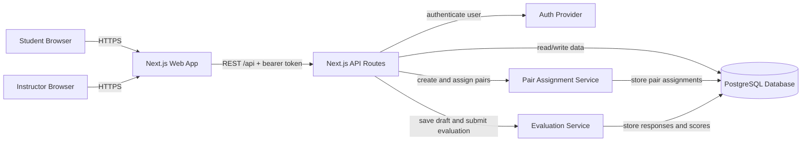

# Component Diagram Draft — PairEval

> Draft สำหรับ WS-02--before
> แสดงสถาปัตยกรรมเป้าหมาย ไม่ใช่รายการ component ที่ implement ครบแล้ว

## Notes
- Student evaluates assigned pairs and submits responses.
- Instructor creates assignments and reviews results.
- API Routes enforce authorization before calling services.
- Pair Assignment Service must prevent self-evaluation.
- Evaluation Service saves drafts and final submissions.

## Comment
**อ่าน diagram นี้อย่างไร**

- `Student Browser` และ `Instructor Browser` คือผู้ใช้สองบทบาท
- `Next.js Web App` คือหน้าจอที่ผู้ใช้กดใช้งาน
- `API Routes` คือ backend endpoint ที่ frontend เรียกผ่าน `/api`
- `Auth Provider` ยืนยันตัวตนและ role
- `Pair Assignment Service` รับผิดชอบสร้างคู่ประเมิน
- `Evaluation Service` รับผิดชอบ draft และการ submit
- `PostgreSQL` เก็บข้อมูลถาวร
- label บนลูกศรบอกว่า “เรียกอะไร/ใช้ protocol อะไร” ซึ่งเป็นเกณฑ์ของ Lab
